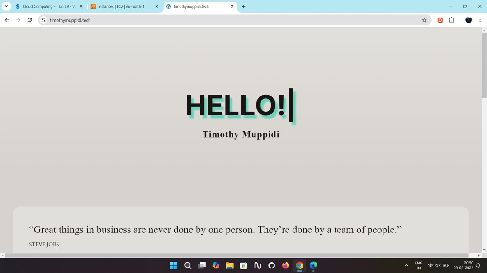
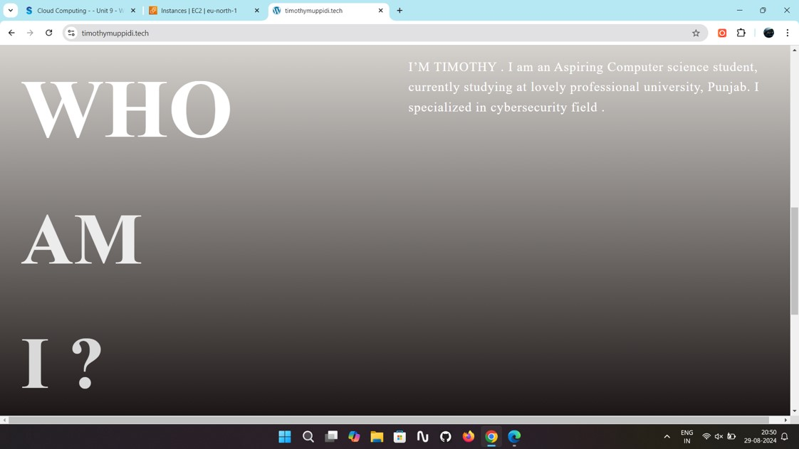
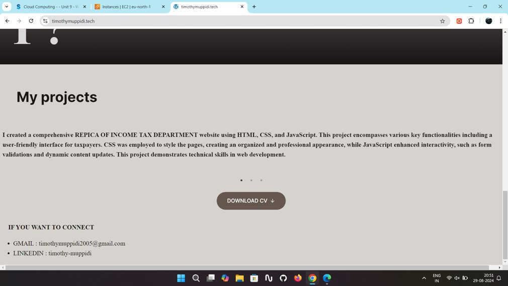

##  Internship

### Summer Internship — Gokboru Tech Pvt. Ltd.
- Gained hands-on experience in **AWS Cloud Computing**, working with services like **EC2**, **S3**, **Route 53**, and **IAM**.
- Developed and deployed a **personal static website**, improving skills in **cloud security**, **networking**, and **deployment**.
- Strengthened **problem-solving** abilities by resolving infrastructure issues, optimizing deployment strategies, and enhancing security configurations.
- Collaborated on real-world cloud projects involving **server management**, **automation**, and **scalable deployment techniques**.

---

## 🚀 Projects

### Static Personal Website | AWS EC2, IAM, WordPress  
**July 2024**
- Developed and hosted a website using **Amazon EC2** with **WordPress** for content management.
- Implemented **IAM roles** and **Elastic IP** to secure and stabilize the deployment.

  
  
  

---

### Replica of Income Tax Department | HTML, CSS, JavaScript  
**October 2022**
- Created a responsive, visually accurate replica of the official website.
- Used **CSS** and **JavaScript** for interactivity and modern UI design principles.

---

## 📜 Certificates

- **Ethical Hacking Essentials** – *Coursera, December 2024*
- **Digital Forensics Essentials** – *Coursera, December 2024*
- **Cloud Computing** – *NPTEL, October 2024*

---

## 🎓 Education

### Lovely Professional University — Punjab  
**B.Tech in Computer Science and Engineering**  
📍 *August 2022 – Present*  
🎓 CGPA: **5.77**

---

### Sri Gayathri Junior College — Hyderabad  
**12th with Science**  
📍 *April 2020 – March 2022*  
📈 Percentage: **81.00%**

---

### D.A.V Public School — Mothugudem  
**10th with Science**  
📍 *April 2019 – March 2020*  
📈 Percentage: **74.00%**

---

## 📄 [Download Resume](.assets/files/timothy Specilzed CV updated2.pdf)
