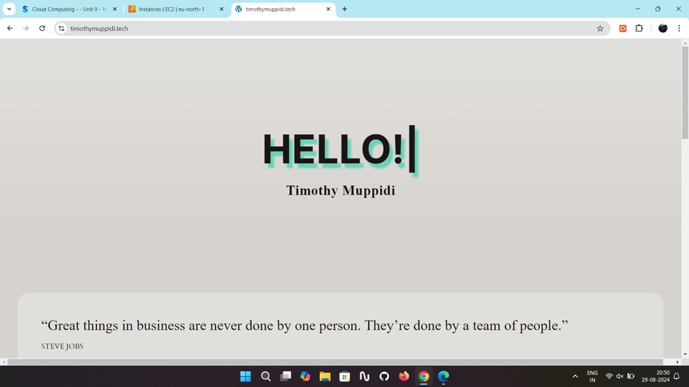

## Internship
### Summer Internship | Gokboru Tech Pvt. Ltd.
- Gained hands-on experience in AWS cloud computing, working with services like EC2, S3, Route 53, and IAM.
- Developed and deployed a personal static website, enhancing skills in cloud security, networking, and deployment.
- Strengthened problem-solving skills by resolving cloud infrastructure issues, optimizing deployment strategies, and improving security configurations.
- Collaborated on real-world cloud projects, enhancing hands-on knowledge of server management, automation, and scalable deployment techniques.

## Static Personal Website | AWS EC2, IAM, WordPress (July 2024)
- Hosted WordPress site on EC2 with secure IAM setup.
- Assigned Elastic IP for persistent access.

### Project Images 

  

    

      
      
EC2 Hosting Setup

    

    

      
      
IAM Security Configuration

    

    

      
      
Elastic IP Setup

    

  

## Certificates
- **Ethical Hacking Essentials** (Coursera) – December 2024
- **Digital Forensics Essentials** (Coursera) – December 2024
- **Cloud Computing** (NPTEL) – October 2024

## Education
- **Lovely Professional University, Punjab**  
  B.Tech. in Computer Science and Engineering  
  CGPA: 5.77 | August 2022 – Present

- **Sri Gayathri Junior College, Hyderabad**  
  12th with Science – Percentage: 81.00% | April 2020 – March 2022

- **D.A.V Public School, Mothugudem**  
  10th with Science – Percentage: 74.00% | April 2019 – March 2020

## Download My Resume
[Download Resume](assets/files/timothy_resume.pdf)

---

