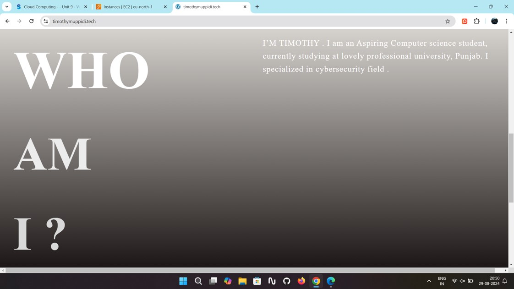

<h3>Static Personal Website | AWS EC2, IAM, WordPress (July 2024)</h3>
<ul>
  <li>Hosted WordPress site on EC2 with secure IAM setup.</li>
  <li>Assigned Elastic IP for persistent access.</li>
</ul>

  

    
    
    
  

